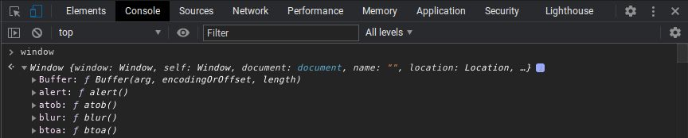

1. require the npm package the you need
```
const Buffer = require('buffer').Buffer
```

2. Append the variable to the window object
```
global.window.Buffer = Buffer
```

3. Install browserify as devDep
```
yarn add browserify -D
```

4. Compile your main.js file using browserify
```
browserify main.js -o output.js
```

5. use your output.js on your html
```
<script src="output.js" ></script>
```

6. run it on live server and check the window object on console if your npm
package is present (in this example, it is Buffer)
